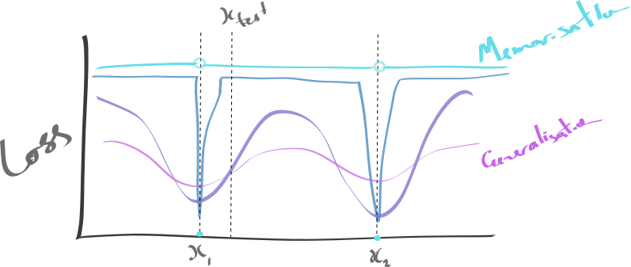

> Random intuitions, yet to be made precise.

## The area under the curve



This suggest that a small pertubation to $x$ should result in a small change in loss, if we want to generalise.

Want something like

$$
\begin{aligned}
\mathbb E[\mathcal L(x_i)] &= \sum_i p(x_i)\mathcal L(x_i) \\
&= \int \mathcal L(x)dx
\end{aligned}
$$

the integral over all likely inputs. This is a way to measure the area under the graph. It should be easy to see that an approximation that generalises should have far lower area.


Is it really true that we that we care exactly about the area under the curve?
So our problem is not only minimising $\mathcal L(x, \theta)$ but ... . How are these related? The only solution is to have some prior on how the surface behaves between data points.
If it has some regular frequency, then is probably should have one here.

## Sorting through hypotheses.

Pick learners with low under-fitting error, then of those pick the ones with low over-fitting error.

Can this be done on mini-batches? We can easily falsify a set of learners/hypotheses if they do not work on a given batch.

```
# find plausible hypotheses.
# ones that have laernt something about the data
for batch in batches:
  # super quick training. high lr, a single batch
  model.train(batch)  
  if model.low_error(batch)
    low_underfit.append(model)
  model.reset()

# pick out the ones that generalise
for model in low_underfit:
  if model.low_error(valid_data):
    best_models.append(model)
```

reminds me of ensemble methods. would be nice to combine the remaining models.

What if we could sort a function? Think of sorting as a transform that can be applied.
Sorting $L(\theta)$ requires evaluating it a bunch of times. Expensive. Is there such a thing as black box sorting?


***

Generalisation is the ability to abstract some pattern from domain X, and successfully apply it to domain Y.

Could design a good experiment for this?

***

Generalisation is about fitting a hypothesis that satifies/explains things, with less care for accuracy? 'Broad' patterns, that abstract some details/noise/complexity away. Doesnt this imply we should use small nets, with lots of weight sharing/few parameters, if we want to learn the most general things? Because the data is pulling in many different directions, and we have to do the best we can with some simple hypothesis. Problem is there is no guarantee we find this hypothesis.


***

<!-- Generalisation could be interpreted as a hierarchical structure? -->
Normally we think of generalisation as capturing some abstract pattern, allowing us to distinguish signal from noise. But this can happen at many different levels
For example: Learning to navigate a city

```
Signal: the connections between roads (a big graph)
Noise: dead ends, driveways,
  Signal: road names, iconic buildings
  Noise:
    Signal: stuff that moves
    Noise: lighting conditions, rain(bows), the sky
```

We have 'general' patterns of all sort of different levels. Buildings are defined by X, a set of roads are abstracted as Y,

Reminds me of how computer science and math is about finding the most abstract/general core of a problem and studying that. This is the goal of `generalisation` (this is yet another sense of generalisation? how does it relate??)?

<!-- What we really want is a handle into these different levels of generalisation/pattern. SO we can pass them around, use them here and there. -->

## Abstraction

> A generalization (or generalisation) is the formulation of general concepts from specific instances by abstracting common properties

Similar in some way.

> Generalization is the process of identifying the parts of a whole, as belonging to the whole. The parts, completely unrelated may be brought together as a group, belonging to the whole by establishing a common relation between them.

So, it's a type of clustering? Where we learn to transforms that group the elements?


## Pattern types

Generalisaiton in NNs is the distillation of repeated patterns (while noise cancels itself out). (??)

Define:
* `pattern`: does this apply to any type of pattern. what is a pattern? a symmetry? a correlation, ?
* `distillation`: we simply sum/average together many different inputs. Could we do this more intelligently? What are other pattern finding strategies?

## Signal and noise

What is the difference between `signal` and `noise`? it seems like something could be signal or a certain capacity net and noise for another?!
